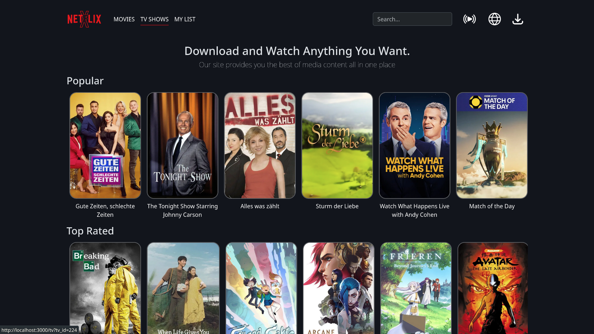

# Netflix-X

## 🎬 Introduction

**Netflix-X** is a movie streaming web application built as part of my second Capstone project. It's also the first project I’ve fully developed using Git and GitHub. As a movie enthusiast, I chose this project idea because it felt the most rewarding and aligned with my interests.

> ⚠️ This project is for educational purposes only.

---

## 🛠️ Installation

This project uses the **OMDb API** and **TMDb API** to fetch movie data.

1. Clone the repository:
   ```bash
   git clone https://github.com/YOUR_USERNAME/Netflix-X.git
   cd Netflix-X
   ```

2. Create a `.env` file in the root directory with your API keys:

   ```env
   omdbApiKey=YOUR_OMDB_API_KEY
   tmdbApiKey=YOUR_TMDB_API_KEY
   ```

3. Install dependencies:

   ```bash
   npm install
   ```

4. Start the server:

   ```bash
   node index.js
   ```

---

## 📸 Screenshots

<p align="center">
    <br>
    <br>
    <br>
    <br>
</p>

---

## 💡 Features

* Search for movies and TV shows
* View detailed information from OMDb and 
* Torrent Download options

---
